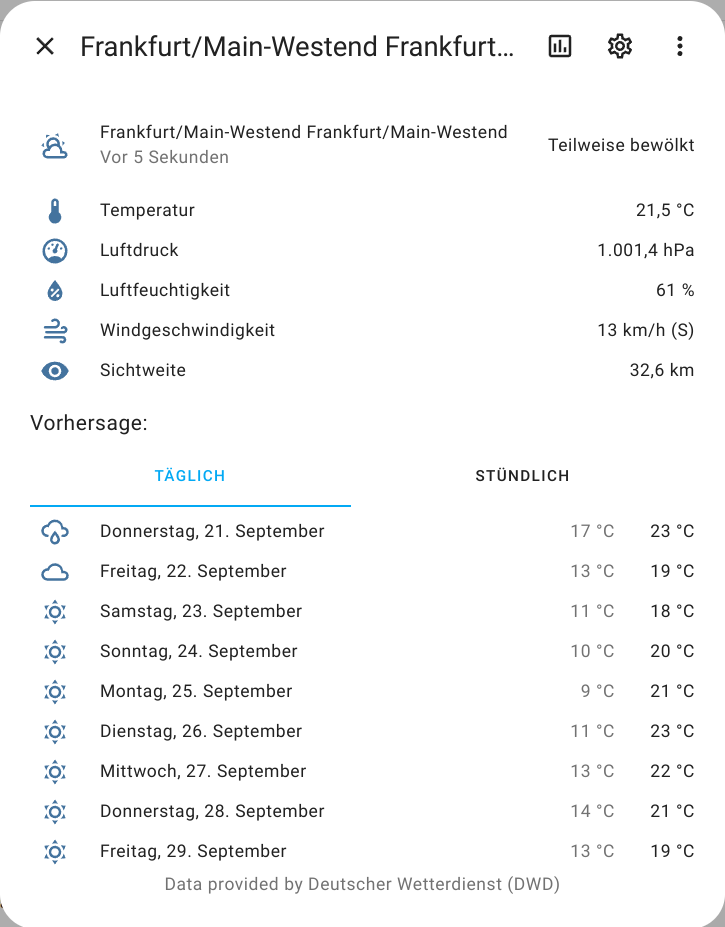
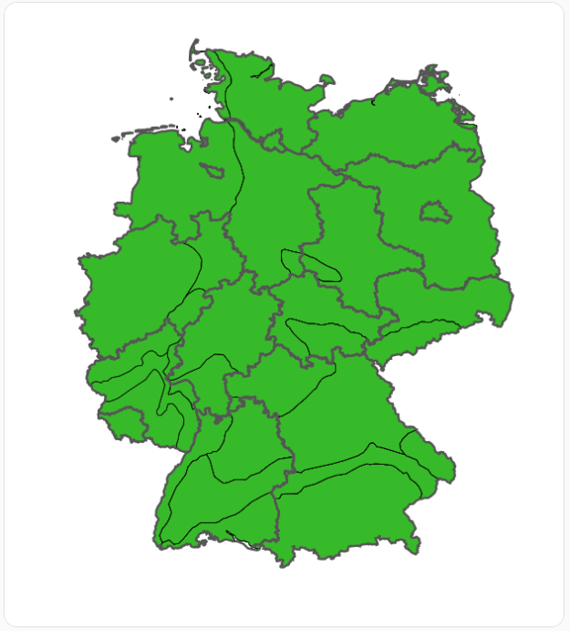
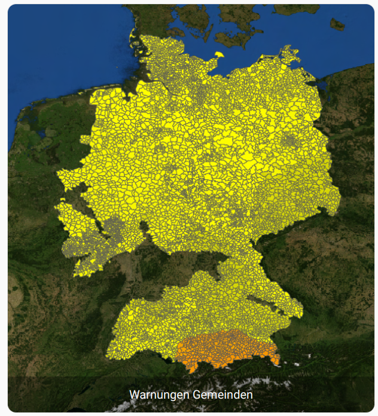
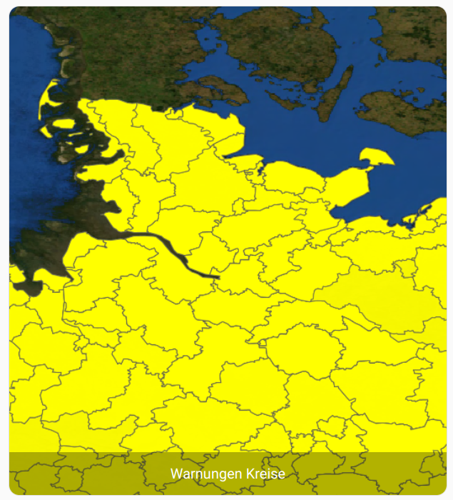

[![GitHub Release][releases-shield]][releases]
[![releases][downloads-shield]][releases]
[![releases][downloads-all-shield]][releases]
[![License][license-shield]](LICENSE)
[![hacs][hacsbadge]](hacs)
[![Community Forum][forum-shield]][forum]
[![BuyMeCoffee][buymecoffeebadge]][buymecoffee]

_DISCLAIMER: This project is a private open source project and doesn't have any connection with Deutscher Wetterdienst._

# Features

- Forecast
   - Daily and hourly, fully integrated into HA weather cards with daily min and max
   - Provides condition, temperature, pressure, humidity, wind speed and visibility
- Weather reports
- Weather Charts
   - Precipitation radar loop
   - Maximum feels like Temperature
   - UV-Index
   - Pollen
   - Satellite RGB
   - Satellite IR
   - Warnungen Gemeinden
   - Warnungen Kreise
- Additional hourly sensors
   - Temperature
   - Dewpoint
   - Pressure
   - Wind speed
   - Wind direction
   - Wind gusts
   - Precipitation
   - Precipitation probability
   - Precipitation duration
   - Cloud coverage
   - Visibility
   - Sun duration
   - Sun irradiance
   - Fog probability

Everything can be configured via the Homeassistant UI. See below for images.

**If you like my work, I would be really happy if you buy me some coffee: [Buy Me A Coffee][buymecoffee]**

---

# Frequently asked questions (FAQ)

Please see the [Wiki](https://github.com/FL550/dwd_weather/wiki)

---





# Installation

1. Install integration via HACS or use the button below.

[](https://my.home-assistant.io/redirect/hacs_repository/?owner=FL550&repository=dwd_weather&category=integration)

2. In the HA UI go to "Configuration" -> "Integrations" click "+" and search for "Deutscher Wetterdienst" or "DWD" or use the button below.
_You can repeat this for as many stations as you like._

[](https://my.home-assistant.io/redirect/config_flow_start/?domain=dwd_weather)


3. Follow the setup instructions.

# Configuration

The configuration is done via UI. You can add as many stations as you like. Each will appear as an individual entity in Home Assistant. You can add more stations by repeating the second step of the install instructions.

# Usage

## Lovelace mode

If you followed the previous steps, you should now have a weather entity inside Home Assistant which contains the weather for today and the next 4 days. To display the weather, you can use the default weather-card where you can select the DWD-weather entity you configured earlier. To add the card follow these steps:

1. Go to the view where you would like to a the weather card.
1. Click on the three dots at the top right corner.
1. Select "Edit Dashboard".
1. Click on the round button with the "plus"-symbol.
1. Pick the "Weather Forecast" card.
1. In the following configuration dialog, choose the weather entity you need.
1. If you would like to display the forecast, check the corresponding slider.
1. Per default the info displayed below the current temperature are the temperature extrema for this day. If if would like to change this, you can enter the following in the field "Secondary Info Attribute":
   - `humidity`
   - `pressure`
   - `wind_bearing`
   - `wind_speed`
   - `visibility`
1. Click on "Save" and voila, you have your own DWD weather forecast.
1. Finally if you like my work, I would be very happy if you [buy me a coffee](https://www.buymeacoffee.com/FL550). :)

## YAML mode

If you are not using the graphical interface and want to use the yaml-mode, you can add the card like this:

```yaml
type: weather-forecast
entity: weather.dwd_weather_*station_name*
```

If you would like to change the secondary info, you have to add this line and replace pressure with whatever info you like:

```yaml
secondary_info_attribute: pressure
```

## Weather report

If you want to get the regional weather report as text, you have to enable the _weather_report_ sensor. For instructions on this see below at [Additional sensor entities](Additional-sensor-entities). You can then include the report in a markdown card. For this, you have to add the following template to the content field where you replace the part after _sensor._ with your weather station:

```yaml
{{ state_attr("sensor.weather_report_homburg_bad", "data") }}
```

To find the correct name for the configured station, have a look at the developer tools within Home Assistant.

## Additional sensor entities

### These are only needed when you want hourly forecast data or a weather report. Daily values are included in the weather entity!

This integration allows you to add sensor entities with hourly forecasts for 10 days:

- Weather condition
- Weather report as text
- Temperature
- Dewpoint
- Pressure
- Wind Speed
- Wind Direction
- Wind Gusts
- Precipitation
- Precipitation Probability
- Precipitation Duration
- Cloud Coverage
- Visibility
- Sun Duration
- Sun Irradiance
- Fog Probability
- Humidity

The sensors entities are disabled per default, as they contain a lot of data.

You can enable the ones you like in HA UI under "Configuration" -> "Entities" -> click on the filter icon on the right -> Check "Show diabled entities" -> Check the ones you like to enable -> Click "ENABLE SELECTED" at the top -> Confirm the next dialog

The sensor values will be set when the next update of dwd_weather is scheduled by Home Assistant. This is done every 15 minutes. You can skip the waiting time by reloading the component/integration or restarting HA.

Note:
If you activate the option for hourly updates during setup of a weather station, DWD does not provide data for precipitation duration and probability. If this or other data is not available for a certain weather station, this component does not create sensors for it. As a workaround you can create setup the same station without activating the hourly updates option and use the slightly less acurate sensor data that is refreshed twice daily.

## Weather charts

This integration provides also some weather charts as camera entities. They can be configured the same as a weather station.

Available data layers:
- Precipitation radar
- Maximum feels like Temperature
- UV-Index
- Pollen
- Satellite RGB
- Satellite IR
- Warnungen Gemeinden
- Warnungen Kreise

### Precipitation Chart


### Pollen Chart


### Alerts Chart


### Custom Chart
The chart can be adjusted to every region you like, however as most data is only provided for Germany, it is best used within these region.



## Help and Contribution

Feel free to open an issue if you find one and I will do my best to help you. If you want to contribute, your help is appreciated! If you want to add a new feature, add a pull request first so we can chat about the details.

## Licenses

This integration uses ['simple_dwd_weatherforecast'](https://github.com/FL550/simple_dwd_weatherforecast) to fetch weather data from Deutscher Wetterdienst (DWD). This integration is based on [Open Data](https://www.dwd.de/DE/leistungen/opendata/opendata.html) from DWD and based on their [Licence](https://www.dwd.de/EN/service/copyright/copyright_artikel.html).

This package uses public data from [DWD OpenData](https://www.dwd.de/DE/leistungen/opendata/opendata.html). The Copyright can be viewed [here](https://www.dwd.de/DE/service/copyright/copyright_node.html).

<!---->

---

[hacs]: https://github.com/custom-components/hacs
[hacsbadge]: https://img.shields.io/badge/HACS-Default-orange.svg?style=for-the-badge
[forum-shield]: https://img.shields.io/badge/community-forum-brightgreen.svg?style=for-the-badge
[forum]: https://community.home-assistant.io/t/deutscher-wetterdienst-dwd/217488
[license-shield]: https://img.shields.io/github/license/custom-components/blueprint.svg?style=for-the-badge
[releases-shield]: https://img.shields.io/github/release/FL550/dwd_weather.svg?style=for-the-badge
[releases]: https://github.com/FL550/dwd_weather/releases
[downloads-shield]: https://img.shields.io/github/downloads/FL550/dwd_weather/latest/total.svg?style=for-the-badge
[downloads-all-shield]: https://img.shields.io/github/downloads/FL550/dwd_weather/total.svg?style=for-the-badge
[buymecoffee]: https://www.buymeacoffee.com/FL550
[buymecoffeebadge]: https://img.shields.io/badge/buy%20me%20a%20coffee-donate-yellow?style=for-the-badge
