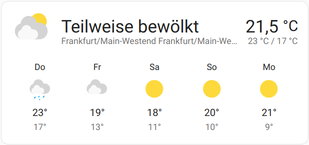
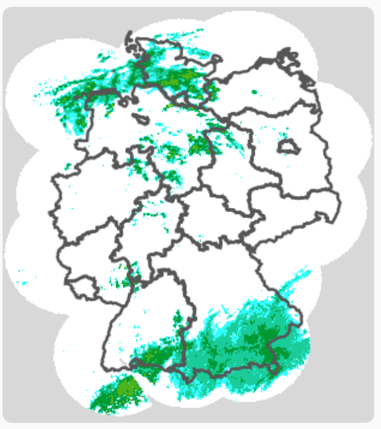

[![GitHub Release][releases-shield]][releases]
[![releases][downloads-shield]][releases]
[![License][license-shield]](LICENSE)
[![hacs][hacsbadge]](hacs)
[![Community Forum][forum-shield]][forum]
[![BuyMeCoffee][buymecoffeebadge]][buymecoffee]

_DISCLAIMER: This project is a private open source project and doesn't have any connection with Deutscher Wetterdienst._



### NB!: This is a Beta version! Please report any errors and bugs



This integration adds a weather data from  Deutscher Wetterdienst (DWD) to HA.

The data is provided via different entities:

- weather
- sensor
- camera

It includes current weather information and forecasts for the next 9 days and some weather maps.

Available datapoints:

- Weather condition
- Weather report as text
- Temperature
- Dewpoint
- Pressure
- Wind Speed
- Wind Direction
- Wind Gusts
- Precipitation
- Precipitation Probability
- Precipitation Duration
- Cloud Coverage
- Visibility
- Sun Duration
- Sun Irradiance
- Fog Probability
- Humidity

The sensors are disabled per default, as they contain a lot of data.

You can enable the ones you like in HA UI under "Configuration" -> "Entities" -> click on the filter icon on the right -> Check "Show diabled entities" -> Check the ones you like to enable -> Click "ENABLE SELECTED" at the top -> Confirm the next dialog

The sensor values will be set when the next update of dwd_weather is scheduled by HA. This is done every 15 minutes. You can skip the waiting time by restarting HA.

For more information please read the [README](github).



## Installation

1. Click install.
1. In the HA UI go to "Configuration" -> "Integrations" click "+" and search for "Deutscher Wetterdienst".
  _You can repeat this for as many stations as you like._
1. Follow the setup instructions.



## Configuration is done in the UI

For further infos about the usage and reporting issues please visit [GitHub](github).

## If you want forecasts for multiple locations, just add a new integration as you did during first install.

***

[hacs]: https://github.com/custom-components/hacs
[hacsbadge]: https://img.shields.io/badge/HACS-Custom-orange.svg?style=for-the-badge
[forum-shield]: https://img.shields.io/badge/community-forum-brightgreen.svg?style=for-the-badge
[forum]: https://community.home-assistant.io/t/deutscher-wetterdienst-dwd/217488
[license-shield]: https://img.shields.io/github/license/custom-components/blueprint.svg?style=for-the-badge
[releases-shield]: https://img.shields.io/github/release/FL550/dwd_weather.svg?style=for-the-badge
[releases]: https://github.com/FL550/dwd_weather/releases
[downloads-shield]: https://img.shields.io/github/downloads/FL550/dwd_weather/total.svg?style=for-the-badge
[github]: https://github.com/FL550/dwd_weather
[buymecoffee]: https://www.buymeacoffee.com/FL550
[buymecoffeebadge]: https://img.shields.io/badge/buy%20me%20a%20coffee-donate-yellow?style=for-the-badge